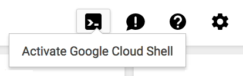

# GKE Photo Album Example

Disclaimer: This is not an official Google product.

This is an example application demonstrating how Cloud Pub/Sub can be used
to implement asynchronous service calls for applications running on GKE.

 

## Products
- [Kubernetes Engine][1]
- [Cloud Storage][2]
- [Cloud Pub/Sub][3]
- [Cloud SQL][4]
- [Cloud Build][5]
- [Cloud Vision][6]

## Language
- [Python][7]

[1]: https://cloud.google.com/kubernetes-engine//docs
[2]: https://cloud.google.com/storage/
[3]: https://cloud.google.com/pubsub/
[4]: https://cloud.google.com/sql/
[5]: https://cloud.google.com/cloud-build/
[6]: https://cloud.google.com/vision/
[7]: https://python.org

## Prerequisites
1. A Google Cloud Platform Account
2. [A new Google Cloud Platform Project][8] for this lab with billing enabled
3. Enable the following APIs from
 [the API Manager][9]

- Kubernetes Engine API
- Cloud SQL Admin API
- Cloud Build API
- Cloud Vision API

[8]: https://console.developers.google.com/project
[9]: https://console.developers.google.com

## Do this first
In this section you will start your [Google Cloud Shell][10] and clone the
 application code repository to it.

1. [Open the Cloud Console][11]

2. Click the Google Cloud Shell icon in the top-right and wait for your shell
 to open:

 

3. Clone the lab repository in your cloud shell, then `cd` into that dir:

```
git clone https://github.com/GoogleCloudPlatform/gke-photoalbum-example.git
cd gke-photoalbum-example
```

[10]: https://cloud.google.com/cloud-shell/docs/
[11]: https://console.cloud.google.com/


## Deploy Photo Album Application

### Prepare Storage Bucket

Create a storage bucket from the Cloud Shell.

```
export PROJECT_ID=$(gcloud config list project --format "value(core.project)")
gsutil mb -c regional -l us-central1 gs://${PROJECT_ID}-photostore
```

Upload the default thumbnail file and make it public.

```
gsutil cp ./application/photoalbum/images/default.png gs://${PROJECT_ID}-photostore/thumbnails/default.png
gsutil acl ch -u AllUsers:R gs://${PROJECT_ID}-photostore/thumbnails/default.png
```

### Create CloudSQL Instance

Create a CloudSQL instance for MySQL database.

- Use "MySQL Development" instance.
- Set Instance ID as `photoalbum-db`.
- Set Root password as your choice.
- Open "Enable auto backups and high availability" and uncheck "Automate backups".
- Others can be left as default.

When the instance creation has been completed, click on the Instance ID name (`photoalbum-db`) and check the Instance connection name. The connection name will be `[Project ID]:us-central1:photoalbum-db` if you chose the configuration options as above.

Connect to the CloudSQL instance from the Cloud Shell and create database `photo_db` and application user `appuser`.

```
gcloud sql connect photoalbum-db --user=root --quiet

create database photo_db;
grant all privileges on photo_db.* to appuser@"%" identified by 'pas4appuser' with grant option;
exit
```

### Create Pub/Sub Topic and Subscription

```
gcloud pubsub topics create thumbnail-service
gcloud pubsub subscriptions create --topic thumbnail-service thumbnail-workers
```

### Create GKE cluster

- Set cluster name as `photoalbum-cluster`.
- Set Number of nodes as `5`.
- Set Access scopes as "Allow full access to all Cloud APIs".
- Others can be left as default.

### Build Container Images

This application has a simple user authentication mechanism. You can change the username and password by modifying the following part in `application/photoalbum/src/auth_decorator.py`.

```
USERNAME = 'username'
PASSWORD = 'passw0rd'
```

Build container images using Cloud Build.

```
export PROJECT_ID=$(gcloud config list project --format "value(core.project)")
gcloud builds submit ./application/photoalbum -t gcr.io/$PROJECT_ID/photoalbum-app
gcloud builds submit ./application/thumbnail -t gcr.io/$PROJECT_ID/thumbnail-worker
```

Check image digests.

```
gcloud container images describe gcr.io/$PROJECT_ID/photoalbum-app:latest --format "value(image_summary.digest)"
gcloud container images describe gcr.io/$PROJECT_ID/thumbnail-worker:latest --format "value(image_summary.digest)"
```

### Deploy Application

Modify the config file `config/photoalbum-deployment.yaml`.

- Change `[PROJECT_ID]` to your project id.
- Change `[CONNECTION_NAME]` to Cloud SQL's connection name that you have checked in the section "Create CloudSQL Instance".
- Change `[DIGEST]` to the image digest of Photo Album application that you have checked in the previous step.

Modify the config file `config/thumbnail-deployment.yaml`.
- Change `[PROJECT_ID]` to your project id.
- Change `[CONNECTION_NAME]` to Cloud SQL's connection name that you have checked in the section "Create CloudSQL Instance".
- Change `[DIGEST]` to the image digest of Thumbnail Generation service that you have checked in the previous step.

You can copy-and-paste the following commands to apply these modifications.

```
PROJECT_ID=$(gcloud config list project --format "value(core.project)")
connection_name=$(gcloud sql instances describe photoalbum-db --format "value(connectionName)")

digest_photoalbum=$(gcloud container images describe gcr.io/$PROJECT_ID/photoalbum-app:latest --format "value(image_summary.digest)")
sed -i.bak "s/\[PROJECT_ID\]/$PROJECT_ID/;s/\[CONNECTION_NAME\]/$connection_name/;s/\[DIGEST\]/$digest_photoalbum/" config/photoalbum-deployment.yaml

digest_thumbnail=$(gcloud container images describe gcr.io/$PROJECT_ID/thumbnail-worker:latest --format "value(image_summary.digest)")
sed -i.bak "s/\[PROJECT_ID\]/$PROJECT_ID/;s/\[CONNECTION_NAME\]/$connection_name/;s/\[DIGEST\]/$digest_thumbnail/" config/thumbnail-deployment.yaml
```

Create GKE resources.

```
gcloud container clusters get-credentials photoalbum-cluster --zone us-central1-a
kubectl create -f config/photoalbum-deployment.yaml
kubectl create -f config/thumbnail-deployment.yaml
kubectl create -f config/photoalbum-service.yaml
```

### Test Application

Confirm that there are three pods for each of photoalbum-app and thembail-worker with STATUS Running, and EXTERNAL-IP is assigned to photoalbum-service. It may take a few minutes until they are all set and running.

```
$ kubectl get pods
NAME                                READY     STATUS    RESTARTS   AGE
photoalbum-app-555f7cbdb7-cp8nw     2/2       Running   0          2m
photoalbum-app-555f7cbdb7-ftlc6     2/2       Running   0          2m
photoalbum-app-555f7cbdb7-xsr4b     2/2       Running   0          2m
thumbnail-worker-86bd95cd68-728k5   2/2       Running   0          2m
thumbnail-worker-86bd95cd68-hqxqr   2/2       Running   0          2m
thumbnail-worker-86bd95cd68-xnxhc   2/2       Running   0          2m

$ kubectl get services
NAME                 TYPE           CLUSTER-IP      EXTERNAL-IP       PORT(S)        AGE
kubernetes           ClusterIP      10.23.240.1     <none>            443/TCP        20m
photoalbum-service   LoadBalancer   10.23.253.241   146.148.111.115   80:32657/TCP   2m
```

Now you can try the application thorugh the URI `http://[EXTERNAL-IP]`.

## Adding Safeimage Feature

You add a safeimage feature that detect offensive images and blur them automatically.

### Create Pub/Sub Topic and Subscription

```
gcloud pubsub topics create safeimage-service
gcloud pubsub subscriptions create --topic safeimage-service safeimage-workers
```

### Setup Pub/Sub Notification
```
export PROJECT_ID=$(gcloud config list project --format "value(core.project)")
gsutil notification create -t safeimage-service -f json gs://${PROJECT_ID}-photostore
```

### Build Container Image

Build a container image using Cloud Build.

```
export PROJECT_ID=$(gcloud config list project --format "value(core.project)")
gcloud builds submit ./application/safeimage -t gcr.io/$PROJECT_ID/safeimage-worker
```

Check an image digest.

```
gcloud container images describe gcr.io/$PROJECT_ID/safeimage-worker:latest --format "value(image_summary.digest)"
```

### Deploy application

Modify the config file `config/safeimage-deployment.yaml`.

- Change `[PROJECT_ID]` to your project id.
- Change `[DIGEST]` to the image digest of Safeimage service that you have checked in the previous step.

You can copy-and-paste the following commands to apply these modifications.

```
digest_safeimage=$(gcloud container images describe gcr.io/$PROJECT_ID/safeimage-worker:latest --format "value(image_summary.digest)")
sed -i.bak "s/\[PROJECT_ID\]/$PROJECT_ID/;s/\[CONNECTION_NAME\]/$connection_name/;s/\[DIGEST\]/$digest_safeimage/" config/safeimage-deployment.yaml
```

Create a deployment resource to roll out Safeimage service.
```
kubectl create -f config/safeimage-deployment.yaml
```

 Confirm that there are three pods of safeimage-worker with STATUS Running. It may take a few minutes until they are all set and running.

```
$ kubectl get pods
NAME                                READY     STATUS    RESTARTS   AGE
photoalbum-app-555f7cbdb7-cp8nw     2/2       Running   0          30m
photoalbum-app-555f7cbdb7-ftlc6     2/2       Running   0          30m
photoalbum-app-555f7cbdb7-xsr4b     2/2       Running   8          30m
safeimage-worker-7dc8c84f54-6sqzs   1/1       Running   0          2m
safeimage-worker-7dc8c84f54-9bskw   1/1       Running   0          2m
safeimage-worker-7dc8c84f54-b7gtp   1/1       Running   0          2m
thumbnail-worker-86bd95cd68-9wrpv   2/2       Running   0          30m
thumbnail-worker-86bd95cd68-kbhsn   2/2       Running   2          30m
thumbnail-worker-86bd95cd68-n4rj7   2/2       Running   0          30m
```

Test the feature using the sample file of a [violent picture](https://pixabay.com/en/zombie-flesh-eater-dead-spooky-949916/). (This is a picture of a zombie biting a human.) 
